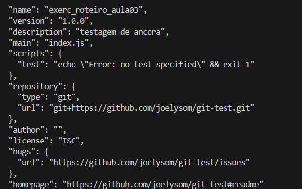
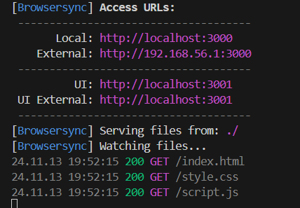
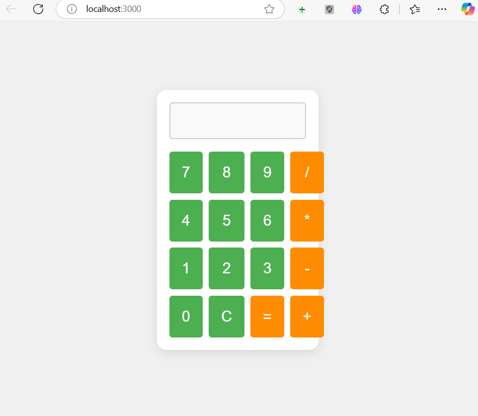
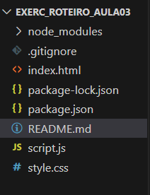

# Exercício da Aula 3 - Passo a Passo

Neste exercício, utilizei o Git e o NPM para configurar e rodar meu projeto. Aqui está o passo a passo:

## 1. Inicializando o Git

Para começar a trabalhar com o Git e conectar meu projeto ao GitHub, utilizei o comando:

```bash
git init
```

Esse comando inicializou um novo repositório Git no diretório atual, criando um espaço para trabalhar no GitHub.

## 2. Criando um arquivo de teste

Tentei criar um arquivo de teste chamado `teste.md` para tentar fazer o upload para o GitHub.

```bash
touch teste.md
```

Com o arquivo criado, fui tentar fazer o upload para o repositório.

## 3. Conectando com o GitHub

Conectei o repositório local com o repositório remoto no GitHub utilizando o seguinte comando:

```bash
git remote add origin https://github.com/joelysom/git-test.git
```

Esse comando associou o repositório local ao repositório online, permitindo enviar as alterações.

## 4. Mudando a branch para 'main'

Em seguida, mudei a branch para `main` utilizando os comandos abaixo:

```bash
git branch  # Verifiquei as branches disponíveis
git checkout -b main  # Criei e mudei para a branch main
```

Isso garantiu que eu estava na branch principal (`main`), que é a convenção mais atual do GitHub.

## 5. Realizando o commit e push

Com a branch correta, fiz as alterações necessárias e preparei para enviar ao GitHub:

```bash
git add .  # Adicionando todos os arquivos para o commit
git commit -m "Primeiro commit na branch main"  # Commit das alterações
git push -u origin main  # Enviando as alterações para o repositório remoto
```

## 6. Problema ao tentar fazer o push

Como o arquivo `teste.md` estava vazio, recebi o erro:

```
To https://github.com/joelysom/git-test.git
 ! [rejected]        main -> main (fetch first)
error: failed to push some refs to 'https://github.com/joelysom/git-test.git'
hint: Updates were rejected because the remote contains work that you do not
hint: have locally. This is usually caused by another repository pushing to
hint: the same ref. If you want to integrate the remote changes, use
hint: 'git pull' before pushing again.
hint: See the 'Note about fast-forwards' in 'git push --help' for details.
```

Esse erro ocorreu porque o repositório remoto já continha alterações que não estavam no meu repositório local. Para resolver isso, usei o seguinte comando:

```bash
git pull origin main --allow-unrelated-histories
```

O parâmetro `--allow-unrelated-histories` permitiu que eu integrasse as alterações mesmo com históricos diferentes entre o repositório local e remoto.

## 7. Deletando o arquivo de teste

Após o erro, decidi deletar o arquivo `teste.md` para evitar mais complicações.

```bash
rm teste.md
```

## 8. Configurando o NPM

Parti para o NPM para configurar meu projeto e instalar as dependências.

Primeiro, usei o comando `npm init` para criar o arquivo `package.json`:

```bash
npm init
```

Durante a configuração, pulei algumas perguntas, aceitando os valores padrões, exceto a definição do ponto de entrada, que defini como `index.html`.



## 9. Editando o `package.json`

Após a criação do `package.json`, editei o arquivo manualmente para incluir o comando de inicialização utilizando o servidor `lite-server`. Isso foi feito para permitir que eu visualize meu projeto no navegador.

## 10. Instalando o `lite-server`

Utilizei o comando abaixo para instalar o `lite-server` como uma dependência de desenvolvimento:

```bash
npm install lite-server --save-dev
```

Isso configurou o `lite-server` como servidor de desenvolvimento para servir meus arquivos HTML, CSS e JavaScript.

## 11. Testando o servidor



Para rodar o servidor, utilizei o comando `npm start`, que executou o `lite-server` configurado no `package.json`.

```bash
npm start
```

Se precisar fechar o servidor, basta pressionar `Ctrl + C` no terminal.

## 12. Criando a Calculadora

Depois de configurar o servidor, criei um projeto de calculadora simples utilizando HTML, CSS e JavaScript.

- **HTML**: Estrutura da página
- **CSS**: Estilo visual da calculadora
- **JavaScript**: Lógica da calculadora (ações de botões, cálculos)

### Exemplo de Código:

**HTML (index.html)**


```html
<!DOCTYPE html>
<html lang="en">
<head>
  <meta charset="UTF-8">
  <meta name="viewport" content="width=device-width, initial-scale=1.0">
  <title>Calculadora</title>
  <link rel="stylesheet" href="style.css">
</head>
<body>
  <div class="calculator">
    <input type="text" id="display" disabled />
    <div class="buttons">
      <button>1</button>
      <button>2</button>
      <button>3</button>
      <button>+</button>
      <button>4</button>
      <button>5</button>
      <button>6</button>
      <button>-</button>
      <button>7</button>
      <button>8</button>
      <button>9</button>
      <button>*</button>
      <button>0</button>
      <button>C</button>
      <button>=</button>
      <button>/</button>
    </div>
  </div>
  <script src="script.js"></script>
</body>
</html>
```

**CSS (style.css)**

```css
body {
  font-family: Arial, sans-serif;
  background-color: #f7f7f7;
  display: flex;
  justify-content: center;
  align-items: center;
  height: 100vh;
}

.calculator {
  background-color: #fff;
  padding: 20px;
  border-radius: 10px;
  box-shadow: 0 0 10px rgba(0, 0, 0, 0.1);
}

button {
  font-size: 1.5rem;
  padding: 20px;
  margin: 5px;
  border: none;
  background-color: #f0f0f0;
  cursor: pointer;
  border-radius: 5px;
}

button:hover {
  background-color: #e0e0e0;
}

#display {
  width: 100%;
  padding: 20px;
  margin-bottom: 20px;
  font-size: 2rem;
  text-align: right;
  border: 1px solid #ccc;
  border-radius: 5px;
}
```

**JavaScript (script.js)**

```javascript
let display = document.getElementById("display");
let buttons = document.querySelectorAll("button");

let currentInput = "";

buttons.forEach(button => {
  button.addEventListener("click", () => {
    if (button.textContent === "=") {
      try {
        currentInput = eval(currentInput).toString();
      } catch (error) {
        currentInput = "Error";
      }
    } else if (button.textContent === "C") {
      currentInput = "";
    } else {
      currentInput += button.textContent;
    }
    display.value = currentInput;
  });
});
```

## 13. Finalizando

Por fim, utilizei o comando `npm run lite` para iniciar o servidor e testar minha calculadora no navegador.

Com isso, o exercício da aula 3 foi concluído, e a calculadora está funcionando corretamente no meu ambiente local!

